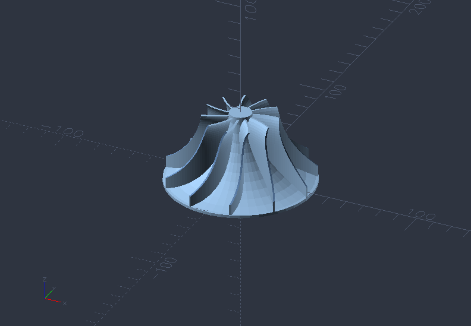
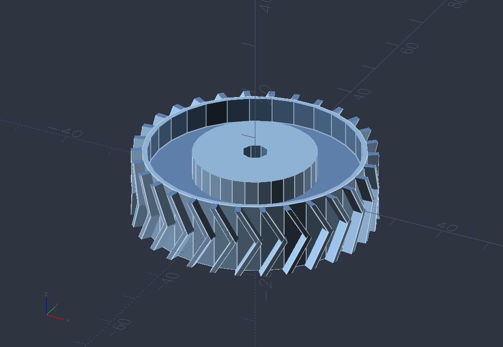

# OpenSCAD x Nord

Bringing the popular Nord color scheme to OpenSCAD renderer. Example below:

## How To Install

Download the nord.json file, and save it in OpenSCAD's color scheme folder. 

For example, OpenSCAD nightly on Windows: C:\Program Files\OpenSCAD (Nightly)\color-schemes\render

## More Examples

## Attribution

Original author of Nord theme: https://github.com/svengreb

Nord theme repository: https://github.com/nordtheme/nord

Screenshots:
- Blades and rotors: https://www.printables.com/model/511607-openscad-generic-blades-and-rotors
- Gears: https://www.thingiverse.com/thing:1339
- Turbojet engine: https://www.thingiverse.com/thing:3367095 

## License

Copyright (C) 2026 isteven

Permission is hereby granted, free of charge, to any person obtaining a copy of this software and associated documentation files (the "Software"), to deal in the Software without restriction, including without limitation the rights to use, copy, modify, merge, publish, distribute, sublicense, and/or sell copies of the Software, and to permit persons to whom the Software is furnished to do so, subject to the following conditions:

The above copyright notice and this permission notice shall be included in all copies or substantial portions of the Software.

THE SOFTWARE IS PROVIDED "AS IS", WITHOUT WARRANTY OF ANY KIND, EXPRESS OR IMPLIED, INCLUDING BUT NOT LIMITED TO THE WARRANTIES OF MERCHANTABILITY, FITNESS FOR A PARTICULAR PURPOSE AND NONINFRINGEMENT. IN NO EVENT SHALL THE X CONSORTIUM BE LIABLE FOR ANY CLAIM, DAMAGES OR OTHER LIABILITY, WHETHER IN AN ACTION OF CONTRACT, TORT OR OTHERWISE, ARISING FROM, OUT OF OR IN CONNECTION WITH THE SOFTWARE OR THE USE OR OTHER DEALINGS IN THE SOFTWARE.

Except as contained in this notice, the copyright holder shall not be used in advertising or otherwise to promote the sale, use or other dealings in this Software without prior written authorization from the copyright holder.