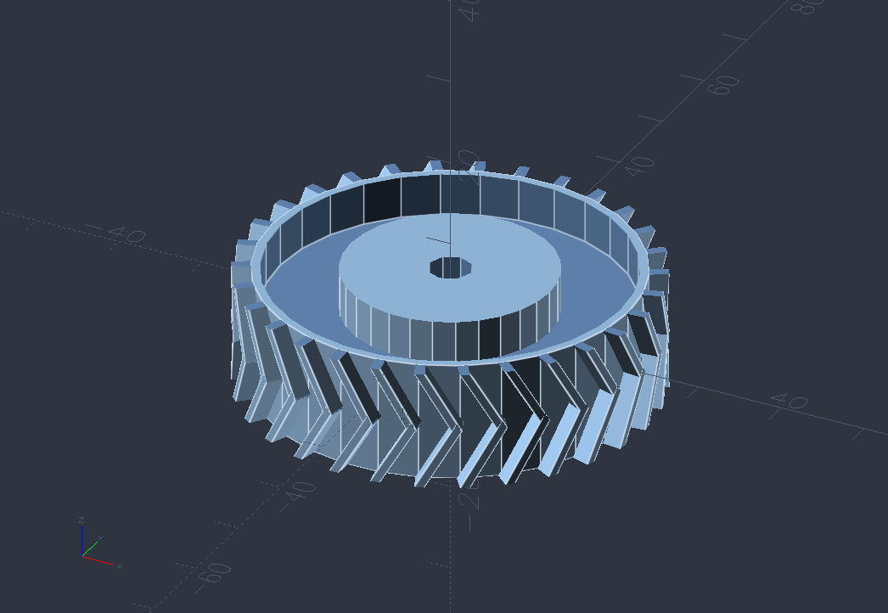
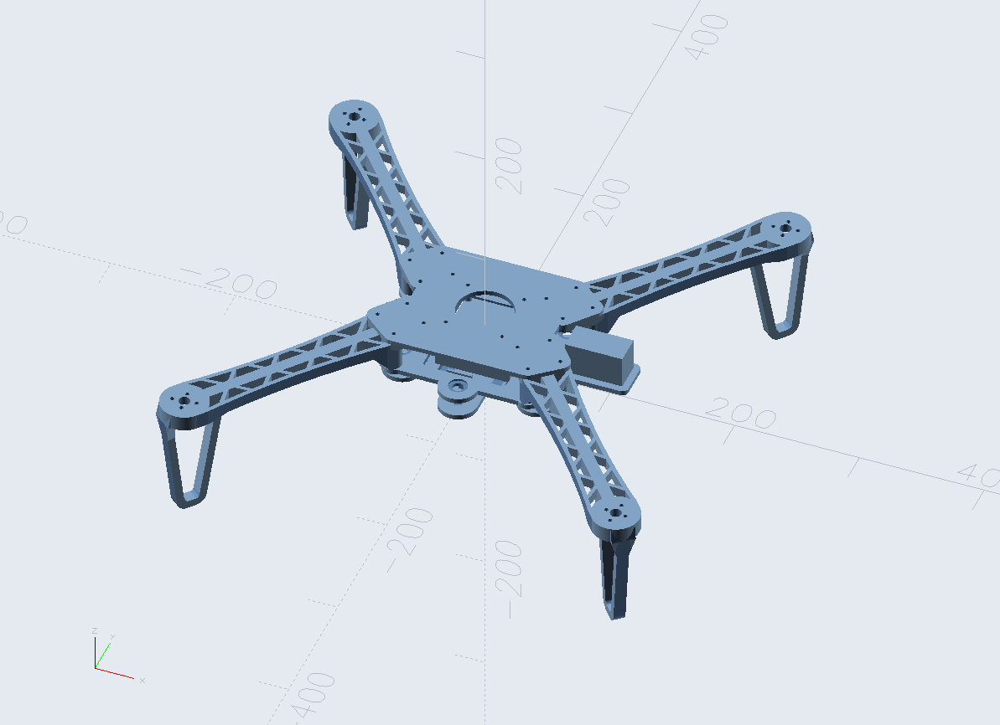

# OpenSCAD x Nord

Nord is an arctic, north-bluish color palette. It consists of sixteen, carefully selected, dimmed pastel colors for a eye-comfortable, but yet colorful ambiance. This port brings the popular Nord color scheme to both OpenSCAD editor and renderer. Example:

## How To Install & Enable

Editor:
1. Go to /editor folder where you can find the dark & light themes.
2. Download & save those files into OpenSCAD's color scheme editor folder. For example, in Windows it would be C:\Program Files\OpenSCAD (Nightly)\color-schemes\editor
3. To enable it, go to OpenSCAD's Edit > Preferences > Editor. Find "Color syntax highlighting" dropdown, and choose "Nord".

Renderer: 
1. Go to /render folder where you can find the dark & light themes.
2. Download & save those files into OpenSCAD's color scheme render folder. For example, in Windows it would be C:\Program Files\OpenSCAD (Nightly)\color-schemes\render 
3. To enable it, go to OpenSCAD's Edit > Preferences > 3D View. Find "Color scheme" list, and choose "Nord".
  
*Note: I use OpenSCAD Nightly build on Windows 11 operating system. Your OpenSCAD path might vary depending on the version and operating system used.*

## More Examples

## Attributions

Original author of Nord theme: https://github.com/svengreb

Nord theme repository: https://github.com/nordtheme/nord

Screenshots:
- Blades and rotors: https://www.printables.com/model/511607-openscad-generic-blades-and-rotors
- Gears: https://www.thingiverse.com/thing:1339
- Turbojet engine: https://www.thingiverse.com/thing:3367095 
- Twin-cylinder engine: https://www.thingiverse.com/thing:576482/files
- Rugged box: https://www.thingiverse.com/thing:4768000/files

## License

MIT License 

Copyright (C) 2026 - present https://github.com/isteven

Permission is hereby granted, free of charge, to any person obtaining a copy of this software and associated documentation files (the "Software"), to deal in the Software without restriction, including without limitation the rights to use, copy, modify, merge, publish, distribute, sublicense, and/or sell copies of the Software, and to permit persons to whom the Software is furnished to do so, subject to the following conditions:

The above copyright notice and this permission notice shall be included in all copies or substantial portions of the Software.

THE SOFTWARE IS PROVIDED "AS IS", WITHOUT WARRANTY OF ANY KIND, EXPRESS OR IMPLIED, INCLUDING BUT NOT LIMITED TO THE WARRANTIES OF MERCHANTABILITY, FITNESS FOR A PARTICULAR PURPOSE AND NONINFRINGEMENT. IN NO EVENT SHALL THE X CONSORTIUM BE LIABLE FOR ANY CLAIM, DAMAGES OR OTHER LIABILITY, WHETHER IN AN ACTION OF CONTRACT, TORT OR OTHERWISE, ARISING FROM, OUT OF OR IN CONNECTION WITH THE SOFTWARE OR THE USE OR OTHER DEALINGS IN THE SOFTWARE.

Except as contained in this notice, the copyright holder shall not be used in advertising or otherwise to promote the sale, use or other dealings in this Software without prior written authorization from the copyright holder.
